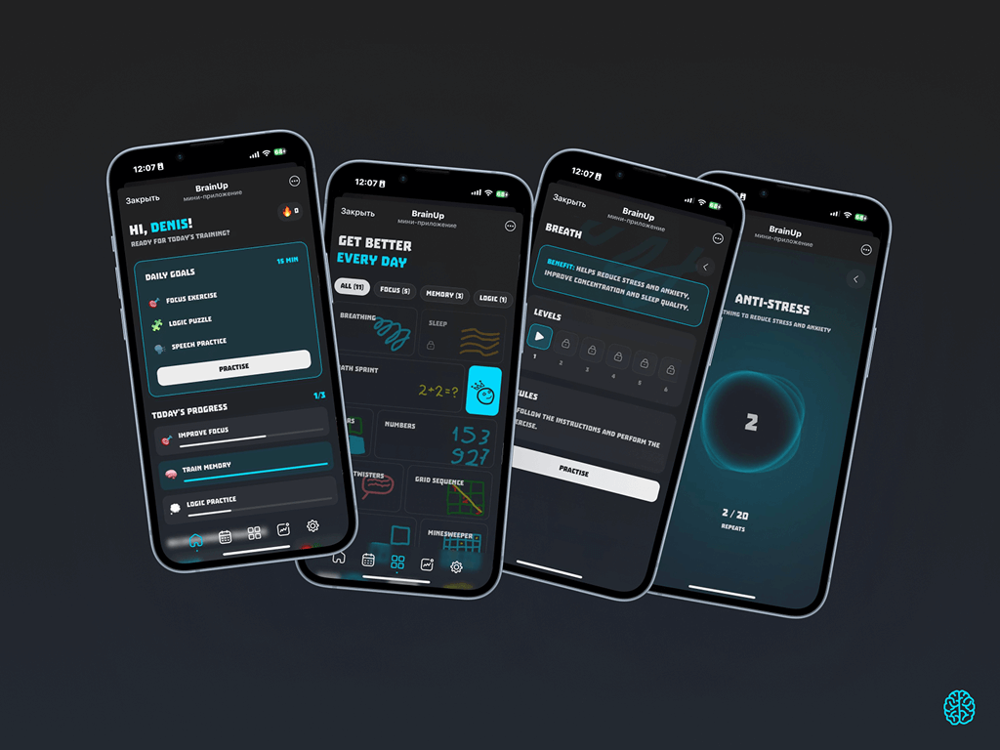

<div align="center">
  
</div>

> **⚠️ Alpha Version** - This project is currently in alpha development stage. Features may be incomplete or subject to change.

# 🧠 BrainUp - Brain Training

Modern web application for developing cognitive abilities through engaging games and exercises. Helps improve attention, memory, logical thinking, and speech skills.

## ✨ Features

- 🎮 **15+ diverse games** for training various cognitive skills
- 🎯 **Personalized training** with daily goals and progress tracking
- 🧩 **5 exercise categories**: attention, memory, logic, speech, breathing
- 📱 **Responsive design** for all devices
- 🌐 **Multilingual support** - Russian and English languages
- 📊 **Analytics and progress tracking**
- 🎵 **Audio accompaniment** for better immersion
- 🏆 **Achievement system** and statistics

## 🎯 Games and Exercises

### 🎯 Attention
- **Minesweeper** - classic game for training attention and logic
- **Grid Sequence** - memorizing sequences in a grid
- **Sequence** - reproducing sequences

### 🧠 Memory
- **Colors** - visual memory training
- **Numbers** - memorizing number sequences
- **Durak** - card game for memory development

### 🧮 Logic
- **Math Sprint** - fast mathematical calculations
- **Math Blocks** - logical puzzles with numbers

### 🗣 Speech
- **Tongue Twisters** - improving diction and articulation
- **Spelling** - literacy training
- **Vocabulary** - expanding lexicon

### 🫁 Breathing
- **Breathing exercises** - techniques for stress relief and concentration improvement

## 🛠 Technologies

- **Frontend**: Vue 3.4.31 with Composition API
- **Language**: TypeScript for strict typing
- **State Management**: Pinia
- **Routing**: Vue Router
- **Internationalization**: Vue I18n
- **Build Tool**: Vite for fast development
- **Testing**: Vitest (unit) + Cypress (e2e)
- **Analytics**: Yandex Metrika
- **Error Monitoring**: Sentry
- **Audio**: Howler.js
- **Styling**: SCSS

## 🚀 Quick Start

```bash
# Install dependencies
yarn install

# Start development server
yarn dev

# Build for production
yarn build

# Preview build
yarn preview

# Run unit tests
yarn test

# Run e2e tests
yarn test:e2e
```

## 📁 Project Structure

```
src/
├── api/              # API integration
├── assets/           # Static resources (icons, images)
├── boots/            # Application initialization
├── components/       # Reusable UI components
│   ├── Games/        # Game components
│   ├── UI/           # Basic UI elements
│   └── Dialogs/      # Modal windows
├── composables/      # Composition functions
├── config/           # Configuration files
├── core/             # Core functionality
├── data/             # Games and categories data
├── i18n/             # Internationalization
├── layouts/          # Page layouts
├── pages/            # Page components
├── router/           # Routing configuration
├── stores/           # Pinia stores
└── types/            # TypeScript types
```

## 🎮 Game Mechanics

Each game is developed based on scientific principles of cognitive training:

- **Progressive difficulty** - levels adapt to user skills
- **Feedback** - instant results and recommendations
- **Gamification** - scoring system, achievements, and statistics
- **Personalization** - individual training plans

## 📊 Progress Tracking

- Daily goals and tasks
- Detailed statistics for each game
- Progress charts and achievements
- Recommendations for improving results

## 🌐 Internationalization

The application supports:
- 🇷🇺 Russian language
- 🇺🇸 English language

New languages can be easily added through the i18n system.

## 🧪 Testing

- **Unit tests** - component and logic coverage
- **E2E tests** - user scenario testing
- **Automated tests** in CI/CD

## 🐳 Docker

```bash
# Build image
docker build -t brainup .

# Run container
docker run -p 3000:80 brainup
```

## 📚 Memory Bank

The project uses a Memory Bank system for maintaining documentation and context:

- `projectbrief.md` - core requirements and project goals
- `productContext.md` - product vision and user experience
- `activeContext.md` - current work focus and decisions
- `systemPatterns.md` - architecture and design patterns
- `techContext.md` - technical stack and tools
- `progress.md` - project progress tracking

This documentation system helps maintain project knowledge and ensures consistent development practices.

## 🤝 Contributing

1. Fork the repository
2. Create a feature branch (`git checkout -b feature/amazing-feature`)
3. Commit your changes (`git commit -m 'Add amazing feature'`)
4. Push to the branch (`git push origin feature/amazing-feature`)
5. Open a Pull Request

## 📄 License

MIT License - see [LICENSE](LICENSE) file for details.

## 🔗 Links

- [Memory Bank System](https://github.com/tacticlaunch/cursor-memory-bank)
- [Vue 3 Documentation](https://vuejs.org/)
- [Vite Documentation](https://vitejs.dev/)

---

<div align="center">
  <strong>Train your brain every day! 🧠✨</strong>
</div>